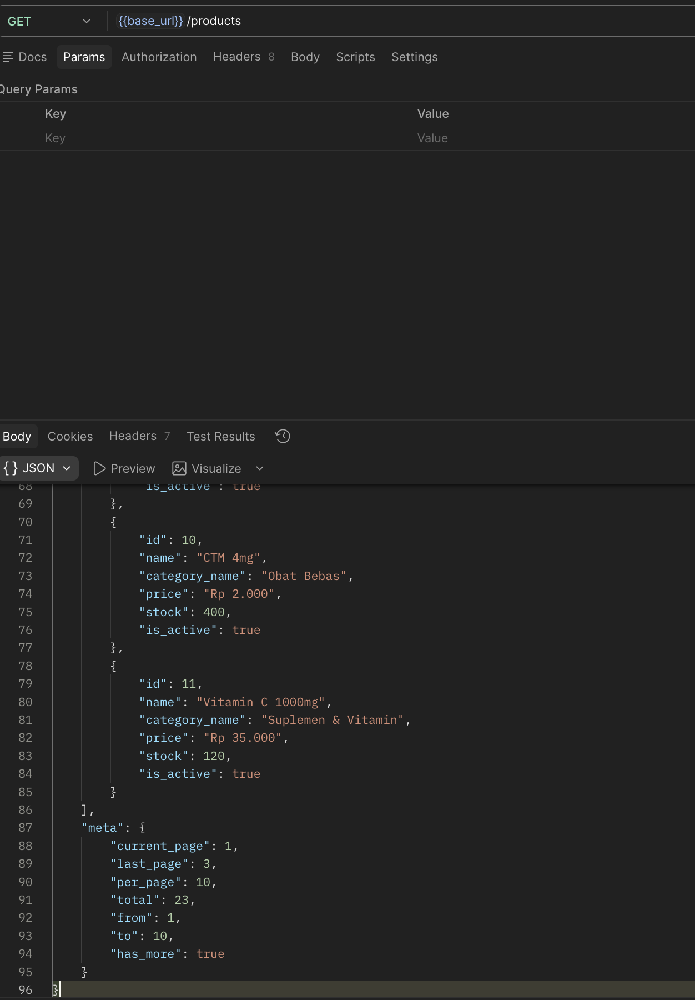
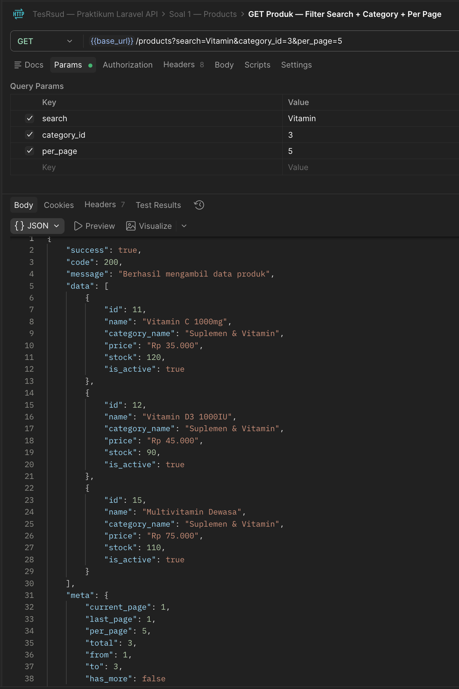

# TesRsud — Praktikum Laravel API

**BAB III — Praktikum Laravel API**
Laravel 13 | REST API | Tanpa Auth

---

## Tech Stack

- **Framework:** Laravel 13
- **Database:** MySQL
- **Cache:** File / Redis
- **Tools:** Postman

---

## Setup

```bash
# 1. Install dependencies
composer install

# 2. Copy environment
cp .env.example .env

# 3. Generate app key
php artisan key:generate

# 4. Sesuaikan konfigurasi DB di .env
DB_CONNECTION=mysql
DB_DATABASE=tes_rsud
DB_USERNAME=root
DB_PASSWORD=

# 5. Jalankan migration
php artisan migrate

# 6. Jalankan seeder
php artisan db:seed

# 7. Jalankan server
php artisan serve
```

---

## Import Postman collection

## Struktur Project

```
app/
├── Http/
│   ├── Controllers/
│   │   └── API/
│   │       ├── Master/
│   │       │   └── ProductController.php
│   │       ├── Transaction/
│   │       │   └── OrderController.php
│   │       └── DashboardController.php
│   ├── Requests/
│   │   └── Transaction/
│   │       └── StoreOrderRequest.php
│   └── Resources/
│       ├── ApiResource.php
│       ├── Master/
│       │   └── ProductResource.php
│       └── Transaction/
│           └── OrderSummaryResource.php
├── Models/
│   ├── Master/
│   │   ├── Category.php
│   │   └── Product.php
│   └── Transaction/
│       └── Order.php
├── Services/
│   ├── Master/
│   │   └── ProductService.php
│   ├── Transaction/
│   │   └── OrderService.php
│   └── DashboardService.php
└── Traits/
    ├── ManipulatedData.php
    └── MessageValidation.php
```

---

## API Endpoints

Base URL: `http://localhost:8000/api`

### Soal 1 — GET Daftar Produk Aktif (25%)

| Method | Endpoint        | Deskripsi                                      |
| ------ | --------------- | ---------------------------------------------- |
| GET    | `/api/products` | Daftar produk aktif dengan filter & pagination |

**Query Parameters:**

| Param         | Tipe    | Deskripsi                             |
| ------------- | ------- | ------------------------------------- |
| `search`      | string  | Filter nama produk (LIKE)             |
| `category_id` | integer | Filter berdasarkan kategori           |
| `per_page`    | integer | Jumlah data per halaman (default: 10) |
| `page`        | integer | Halaman ke-                           |

**Response:**

```json
{
    "success": true,
    "code": 200,
    "message": "Berhasil mengambil data produk",
    "data": [
        {
            "id": 1,
            "name": "Paracetamol 500mg",
            "category_name": "Obat",
            "price": "Rp 5.000",
            "stock": 100,
            "is_active": true
        }
    ],
    "meta": {
        "current_page": 1,
        "last_page": 3,
        "per_page": 10,
        "total": 25,
        "from": 1,
        "to": 10,
        "has_more": true
    }
}
```

---

### Soal 2 — POST Order (35%)

| Method | Endpoint      | Deskripsi         |
| ------ | ------------- | ----------------- |
| POST   | `/api/orders` | Buat pesanan baru |

**Request Body:**

```json
{
    "product_id": 1,
    "qty": 2
}
```

**Validasi (Bahasa Indonesia):**

- `product_id` wajib diisi, harus ada di tabel products
- `qty` wajib diisi, integer, minimal 1

**Response Sukses (201):**

```json
{
    "success": true,
    "code": 201,
    "message": "Order berhasil dibuat",
    "data": {
        "id": 1,
        "product": { "id": 1, "name": "Paracetamol 500mg" },
        "user": null,
        "qty": 2,
        "total_price": "Rp 10.000",
        "status": "pending",
        "created_at": "2026-04-22T10:00:00.000000Z"
    }
}
```

**Response Stok Kurang (422):**

```json
{
    "success": false,
    "code": 422,
    "message": "Stok produk tidak mencukupi"
}
```

---

### Soal 3 — Dashboard Analytics (40%)

| Method | Endpoint                 | Deskripsi               |
| ------ | ------------------------ | ----------------------- |
| GET    | `/api/dashboard/summary` | Ringkasan performa toko |
| DELETE | `/api/dashboard/cache`   | Flush cache dashboard   |

**Response GET /api/dashboard/summary:**

```json
{
    "success": true,
    "code": 200,
    "message": "Berhasil mengambil data dashboard",
    "data": {
        "statistics": {
            "total_revenue": 1500000,
            "total_orders_today": 5,
            "total_products_active": 20,
            "low_stock_count": 3
        },
        "top_products": [
            {
                "product_id": 1,
                "product_name": "Paracetamol 500mg",
                "category": "Obat",
                "total_sold": 50
            }
        ],
        "recent_orders": [...],
        "from_cache": false
    }
}
```

> Cache TTL: **300 detik**. Cek field `from_cache: true/false` untuk verifikasi cache aktif.

---

### Bonus — Scoped Binding (+10 poin)

| Method | Endpoint                           | Deskripsi                 |
| ------ | ---------------------------------- | ------------------------- |
| GET    | `/api/users/{user}/orders/{order}` | Order spesifik milik user |

Order yang bukan milik user akan mengembalikan **404**.

---

## Postman Collection

Import file `TesRsud.postman_collection.json` ke Postman.

**Collection Variables:**

| Variable   | Default                     | Keterangan                          |
| ---------- | --------------------------- | ----------------------------------- |
| `base_url` | `http://localhost:8000/api` | Sesuaikan port                      |
| `user_id`  | `1`                         | ID user untuk bonus scoped binding  |
| `order_id` | `1`                         | ID order untuk bonus scoped binding |

---

## Database Schema

```
categories  : id, name, slug, timestamps
products    : id, name, category_id (FK), price decimal(10,2), stock, is_active, timestamps
orders      : id, user_id (FK nullable), product_id (FK), qty, total_price, status, timestamps
users       : id, name, email, password, timestamps (default Laravel)
```

## SS hasil



